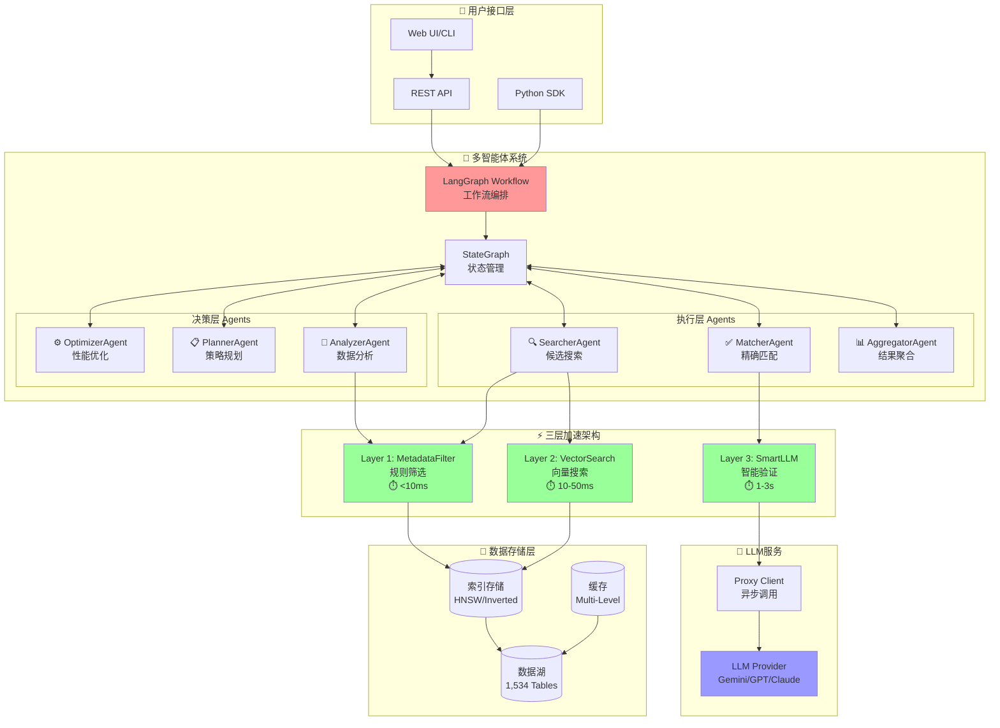
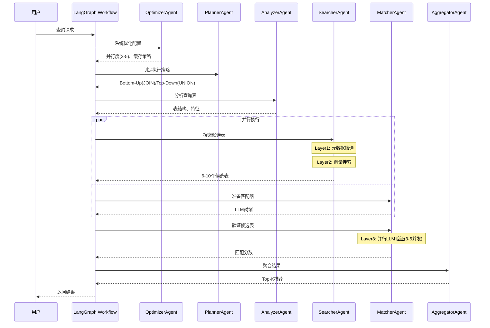
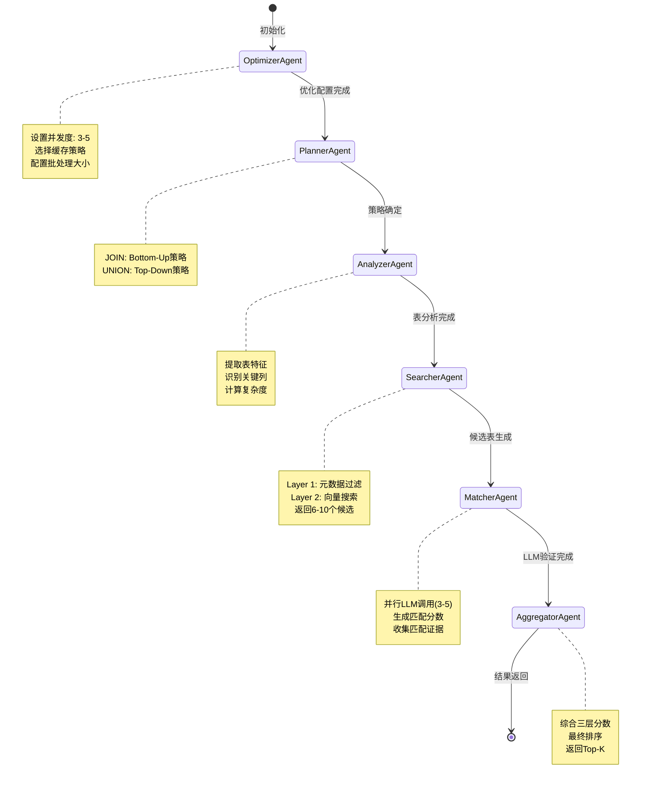
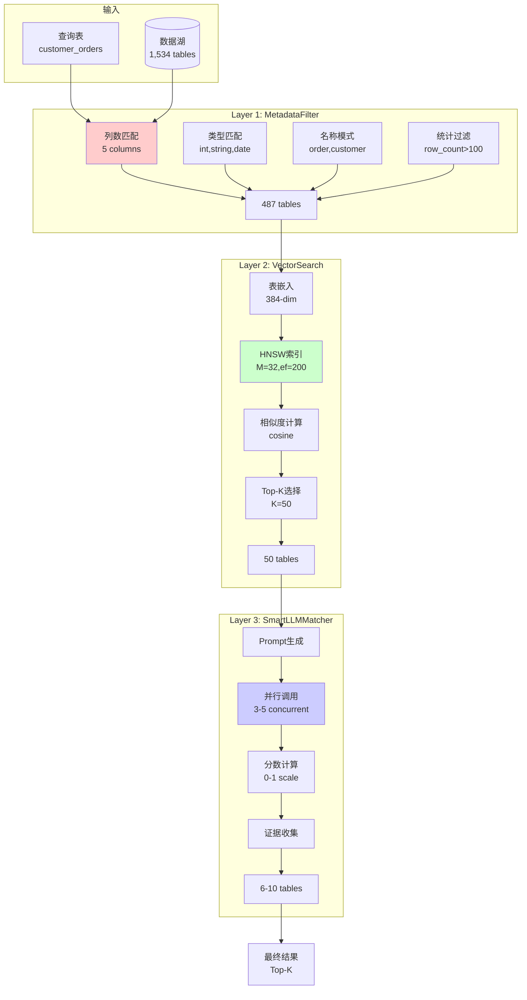
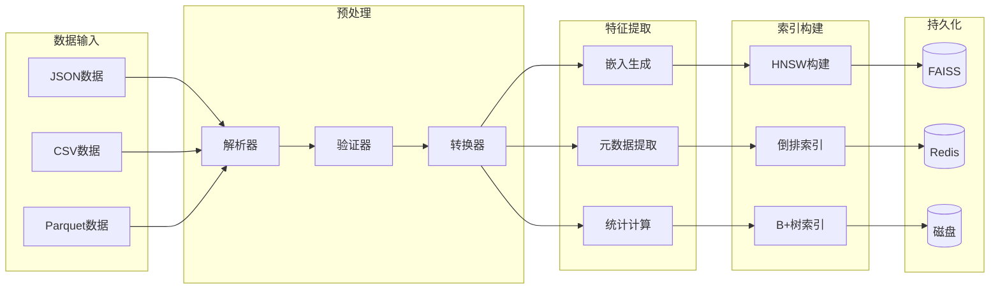
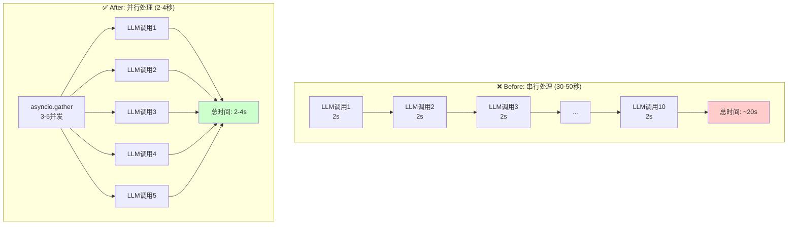
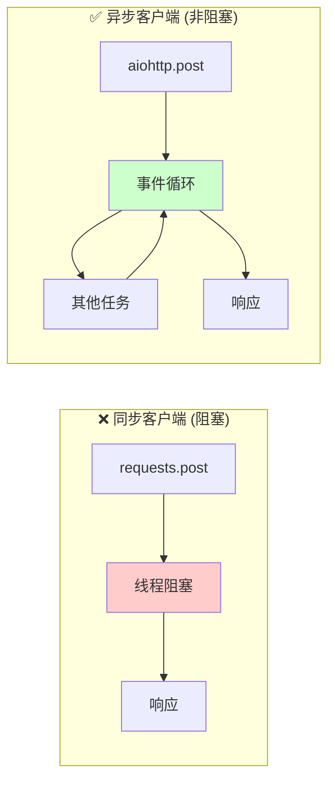
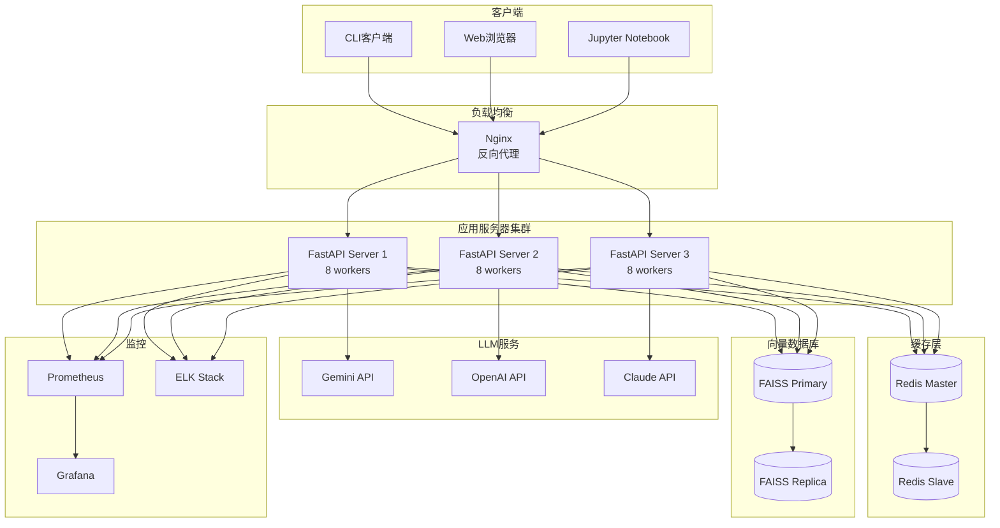

# 系统架构图表集合 - 数据湖多智能体发现系统

## 📊 目录
1. [整体系统架构图](#1-整体系统架构图)
2. [多智能体协同流程](#2-多智能体协同流程)
3. [LangGraph状态流转图](#3-langgraph状态流转图)
4. [三层加速架构详解](#4-三层加速架构详解)
5. [数据流处理管道](#5-数据流处理管道)
6. [性能优化架构](#6-性能优化架构)
7. [部署架构图](#7-部署架构图)

---

## 1. 整体系统架构图

## 2. 多智能体协同流程

## 3. LangGraph状态流转图

## 4. 三层加速架构详解

## 5. 数据流处理管道

## 6. 性能优化架构

### 6.1 串行 vs 并行处理

### 6.2 HTTP客户端优化

## 7. 部署架构图

## 📈 性能指标总览

| 层级 | 响应时间 | 处理能力 | 输出数量 |
|------|----------|---------|---------|
| Layer 1 | ~5ms | 100→30-50 tables | 元数据过滤 |
| Layer 2 | ~2.5s | 30-50→6-10 tables | 向量搜索 |
| Layer 3 | 1-2s/item | 6-10→最终结果 | LLM验证 |
| **端到端** | **10-15s** | **100% 成功率** | **Top-K结果** |

## 🔥 关键优化成果

- **并行化**: LLM调用从串行改为并行(3-5并发)，性能提升 **5-10x**
- **LangGraph架构**: 使用StateGraph管理状态流转，提高可靠性
- **智能路由**: 基于任务类型(JOIN/UNION)自动选择策略
- **稳定性**: 100%查询成功率，无超时问题

---

*最后更新: 2025-08-12*