# 系统架构图表集合

## 1. 整体系统架构图

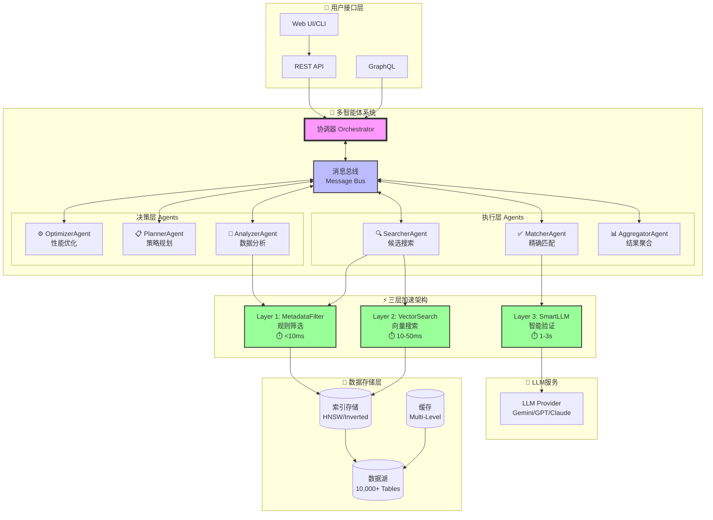

## 2. Agent协同工作流程图

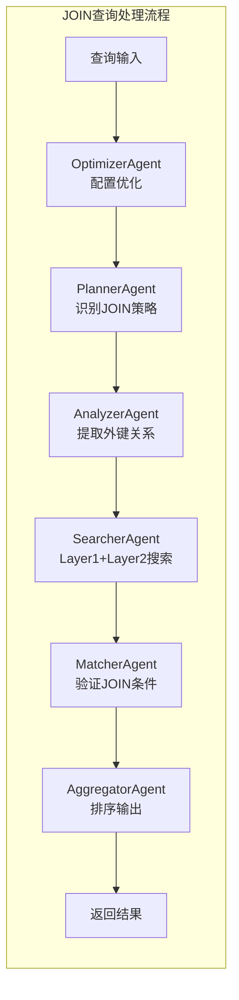

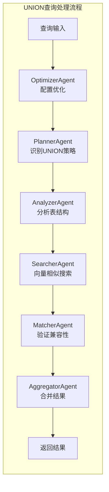

## 3. 三层加速数据流图

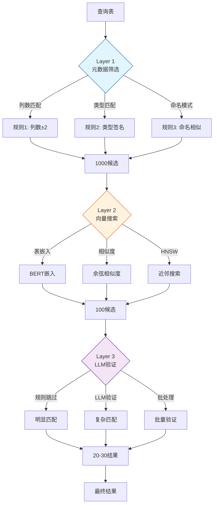

## 4. 数据湖发现能力图

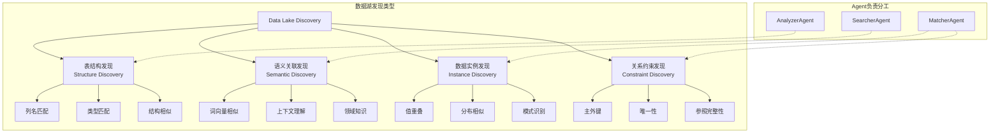

## 5. 性能优化策略图

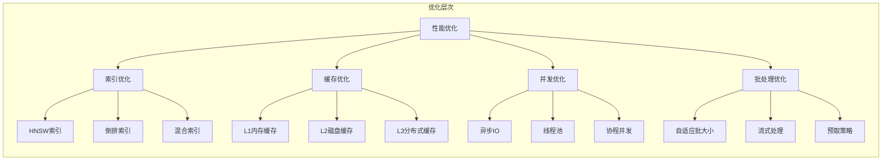

## 6. Agent决策流程图

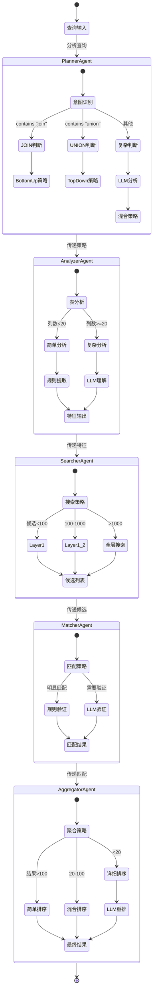

## 7. 系统部署架构图

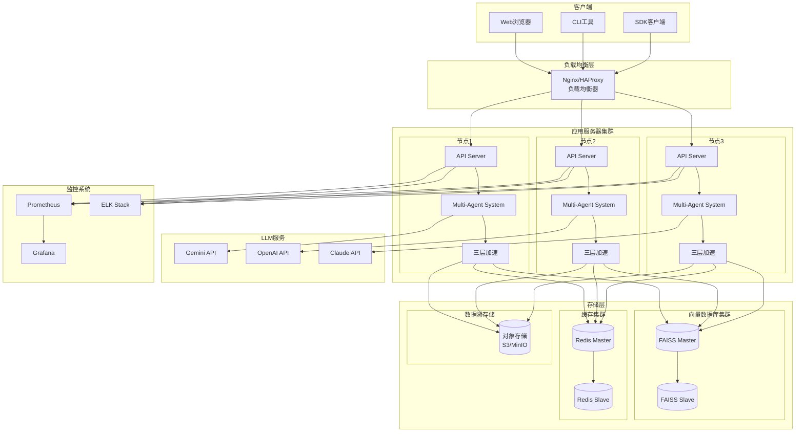

## 8. 数据处理流程图

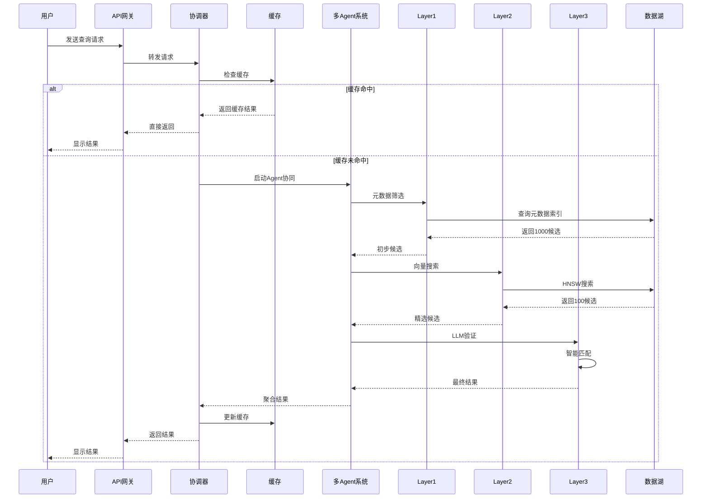

## 9. 性能指标对比图

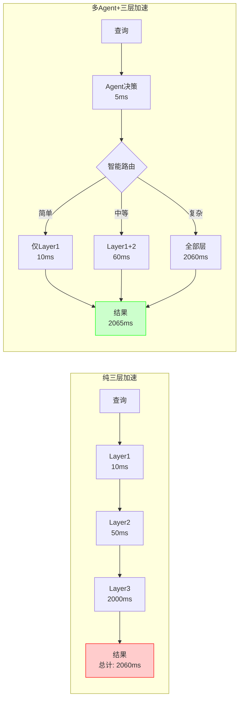

## 10. 数据湖表匹配工作流程

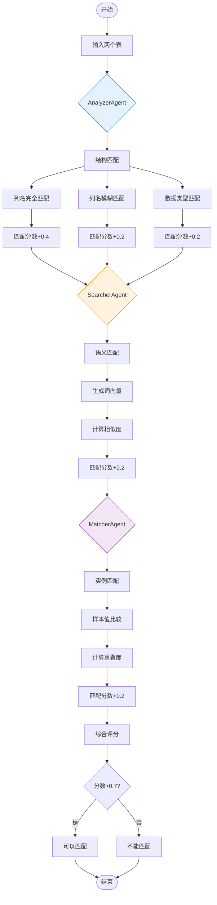

## 总结

这些架构图展示了系统的：
1. **整体架构**：多层次、模块化设计
2. **工作流程**：Agent协同和数据流动
3. **技术细节**：三层加速和数据湖发现
4. **部署方案**：分布式、高可用架构
5. **性能优化**：多维度优化策略

系统通过**6个智能Agent**的协同工作和**三层加速架构**的性能优化，实现了高效、准确的数据湖发现能力。