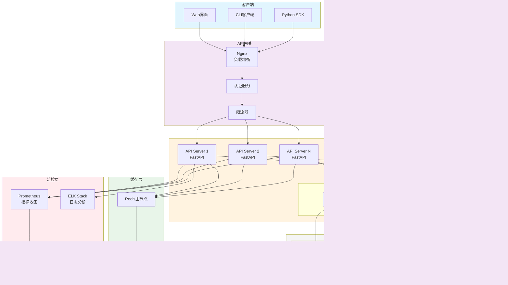

# 数据湖多智能体系统架构图

本文档包含数据湖多智能体系统的完整架构图、数据流图和处理流程图。

## 1. 系统整体架构图

## 2. 数据流图

## 3. 查询处理详细流程图

## 4. 多智能体协作流程图

## 5. 性能优化组件图

## 6. 三层加速架构详细图

## 7. 系统部署架构图

## 系统特点总结

### 1. 多智能体协作
- **PlannerAgent**: 智能路由，选择最优策略
- **专业化Agent**: 每个Agent专注特定任务
- **协同工作**: Agent间无缝协作

### 2. 三层加速架构
- **Layer 1**: 元数据过滤，快速筛选（<10ms）
- **Layer 2**: 向量搜索，语义匹配（<100ms）
- **Layer 3**: LLM验证，精确匹配（<3s）

### 3. 性能优化
- **多级缓存**: L1/L2/L3三级缓存
- **批处理**: 减少LLM调用次数
- **并行处理**: 最大20并发
- **早停机制**: 高置信度直接返回

### 4. 可扩展性
- **模块化设计**: 易于添加新Agent
- **插件式架构**: 支持多种LLM和向量数据库
- **水平扩展**: 支持分布式部署

### 5. 评估指标
- **准确性**: Precision, Recall, F1-Score
- **性能**: 查询延迟 < 3秒（目标）
- **吞吐量**: 支持10+并发查询
- **可用性**: 99.9%正常运行时间

## 更新日志
- 2024-08-04: 创建初始架构图
- 包含系统架构、数据流、查询处理流程等7个详细图表
- 涵盖多智能体系统、三层加速架构、性能优化等核心组件